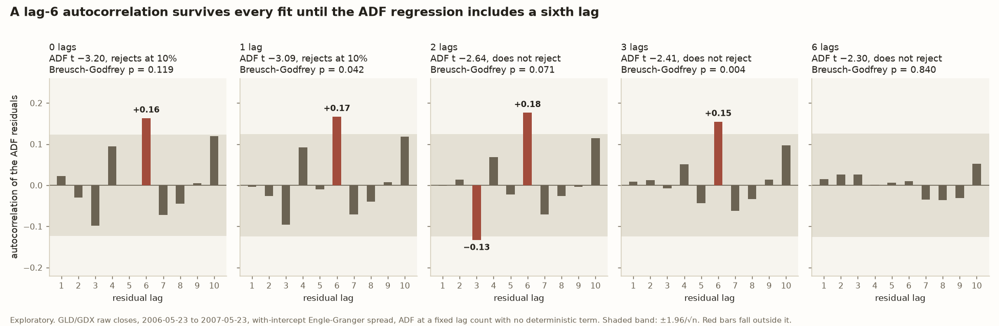

# How to test whether a price spread mean-reverts

*A walk through Engle-Granger, lag selection and the half-life, using Chan’s GLD/GDX and KO/PEP examples.*

## Why the spread matters

Pairs trading holds one asset long and the other short, typically using a hedge ratio to construct the spread. The strategy is essentially a bet that deviations of the spread from its long-run equilibrium will eventually reverse. Because the long and short positions offset some common market exposure, the strategy seeks to reduce dependence on the overall direction of the market.

That bet only pays if the spread is stationary, meaning it keeps returning to a stable level. Correlated returns are not evidence of that. KO and PEP’s daily returns are correlated at 0.4849 over 31 years of Chan’s data, yet their prices do not test as cointegrated. So apply an Engle-Granger or Johansen test to the price series before trading a pair. This post covers what a stationary spread is, how to test for one with Engle-Granger, how the test’s lag choice can change its verdict, and how long a trade on the spread should last.

## What a cointegrated spread is

### Stationarity and random walks

In *Quantitative Trading*, Ernest Chan claims that many individual asset price time series are nonstationary. Stationarity means that a time series has stable statistical properties over time. In the mean-reverting cases relevant to pairs trading, the series fluctuates around a stable mean. By contrast, asset prices can often be approximated as random walks, which have no tendency to revert to a fixed mean and whose uncertainty about the price level grows over time.

### Cointegration

Chan further argues that a linear combination of economically related assets may produce a stationary spread even when the individual asset prices are nonstationary. Assets with common economic drivers can therefore be reasonable candidates to test for cointegration, although economic similarity does not guarantee cointegration. Cointegration exists when a linear combination of nonstationary asset prices is stationary. For example, for two assets `xₜ` and `yₜ`, there may be a hedge ratio `β` such that the spread `zₜ` is stationary.

```math
y_t = \alpha + \beta x_t + z_t
```

This gives:

1. `β` is the slope or hedge ratio.
2. `α` is the intercept. It is the average market value of the hedged portfolio over the fit window, and the level that market value reverts to.
3. `zₜ` is the estimated spread.

This is saying: “How many shares of `xₜ` are needed to hedge one share of `yₜ`?”

Rearrange it to solve for the spread.

```math
z_t = y_t - \beta x_t - \alpha
```

### The residual tracks the portfolio’s market value

Hold one specific portfolio: long 1 share of GLD, the gold ETF (`yₜ`), and short `β` shares of GDX, the gold-miners ETF (`xₜ`). Its net market value is the long leg minus the short leg:

```math
V_t = y_t - \beta x_t
```

So `zₜ = Vₜ − α`. The residual spread tracks the portfolio’s value on every day, shifted down by the intercept. The portfolio value `Vₜ` reverts to `α`, and the spread `zₜ` reverts to 0.

```math
\bar{z} = 0 \quad\Longrightarrow\quad \bar{V} = \bar{z} + \alpha = \alpha
```

## How to test for cointegration

The question: is `zₜ` stationary? If yes, then `yₜ` and `xₜ` are cointegrated.

### The Engle-Granger test

#### Step 1: Estimate the long-run relationship

Run an ordinary least squares (OLS) regression using the linear relationship.

```math
y_t = \alpha + \beta x_t + z_t
```

The regression finds the `β` and `α` that make the fitted price `α + βxₜ` as close as possible to the actual price `yₜ`.

The goal is to minimize the sum of the squared spreads. In other words, find the line that makes the squared prediction errors as small as possible.

```math
\sum_{t} z_t^2
```

Then calculate the spread `zₜ` from the estimated `β` and `α`.

##### Why OLS?

OLS with an intercept makes the residual spread average zero by construction. Minimizing the squared errors over `α` sets their sum to zero:

```math
\frac{\partial}{\partial \alpha} \sum_t \left( y_t - \alpha - \beta x_t \right)^2 = -2 \sum_t z_t = 0 \quad\Longrightarrow\quad \bar{z} = 0
```

Without the intercept there is no `α` to solve for, and nothing forces the sum to zero. A different fitting method, such as least absolute deviations, makes the *median* residual zero, not the *mean*.

The Engle-Granger critical values come from simulations by the economist James MacKinnon (2010). His tables assume a specific setup: an intercept in the cointegrating regression, then an augmented Dickey-Fuller (ADF) test with no constant on its residuals. A second constant in Step 2 changes the values the statistic takes when the pair is not cointegrated, and the tables no longer describe them.

##### With intercept or through origin?

A through-origin fit drops the intercept and forces the line through zero:

```math
y_t = \beta_0 x_t
```

Two things decide between the fits:

1. **The spread’s variance.** The fit with an intercept gives the smallest possible residual variance over all lines. The through-origin fit only gets the smallest variance among lines through zero, so its spread is wider.
2. **Whether the test is valid.** Engle-Granger’s critical values assume a fit with an intercept, followed by an ADF without a constant on its zero-mean residuals.

##### Approximate the through-origin slope

The through-origin slope `β₀` is the hedge ratio Chan prints. The ratio of the average prices approximates it:

```math
\beta_0 = \frac{\sum_t x_t \, y_t}{\sum_t x_t^2} \approx \frac{\bar{y}}{\bar{x}}
```

The approximation holds when prices move only a little compared with their level, which is usual for daily prices. On Chan’s Chapter 7 window, 385 trading days from 2006-05-23 to 2007-11-30 in his archived price files, the ratio gives 1.642 against a through-origin slope of 1.640. The with-intercept `β` is 1.386, so the ratio is a quick check on `β₀` and not a substitute for `β`.

#### Step 2: Test whether the spread is stationary

Run an ADF test on the spread `zₜ`. This is another OLS regression, but on the estimated spread time series instead of the price time series.

```math
\Delta z_t = \gamma z_{t-1} + \sum_{i=1}^{p} \phi_i \Delta z_{t-i} + \varepsilon_t
```

`Δzₜ` is the change in the spread from one day to the next:

```math
\Delta z_t = z_t - z_{t-1}
```

The null hypothesis says the spread is nonstationary.

```math
H_0:\gamma = 0
```

The alternative hypothesis says there is stationarity.

```math
H_1:\gamma < 0
```

The ADF statistic is the estimate of `γ` divided by its standard error. Reject the null hypothesis when the statistic is more negative than the critical value. MacKinnon’s residual-based tables give these critical values for two series:

```math
\begin{array}{c|c|c}
\text{Significance} & \text{Confidence} & \text{Critical value} \\ \hline
10\% & 90\% & -3.04 \\
5\% & 95\% & -3.34 \\
1\% & 99\% & -3.90
\end{array}
```

These are more negative than the plain ADF values of −1.62, −1.94 and −2.57. Step 1 already picked the `β` that makes the spread’s variance as small as possible, which is the combination of the two prices that looks most stationary. So even two unrelated random walks leave a spread that looks mean-reverting, and the stricter values correct for that. KO and PEP below show the difference: their −2.14 passes the plain ADF at 5% and fails every Engle-Granger value.

##### Why augmented Dickey-Fuller?

Real time series have autocorrelation in their errors. Autocorrelation means prior values affect the current value. The added lagged differences of the spread account for that.

The change in the spread depends on the prior spread and on up to `p` prior changes:

```math
z_{t-1}, \quad \Delta z_{t-1}, \quad \Delta z_{t-2}, \dots, \Delta z_{t-p}
```

Run an OLS regression on the ADF equation to estimate the coefficients `γ` and `φ₁` through `φₚ`.

Using a lag `p = 2` gives the ADF equation below.

```math
\Delta z_t = \gamma z_{t-1} + \phi_1 \Delta z_{t-1} + \phi_2 \Delta z_{t-2} + \varepsilon_t
```

Suppose an example spread time series like below.

```math
\begin{array}{c|ccccc}
t & 1 & 2 & 3 & 4 & 5 \\ \hline
z_t & 2.0 & 1.5 & 0.5 & 0.8 & 0.2
\end{array}
```

For `t = 4`.

```math
\begin{gather*}
\Delta z_4 = z_4 - z_3 = 0.8 - 0.5 = 0.3 \\
z_3 = 0.5 \\
\Delta z_3 = 0.5 - 1.5 = -1.0 \\
\Delta z_2 = 1.5 - 2.0 = -0.5 \\
0.3 = \gamma(0.5) + \phi_1(-1.0) + \phi_2(-0.5) + \varepsilon_4
\end{gather*}
```

This yields a dataset like below.

```math
\begin{array}{c|c|ccc}
t & \Delta z_t & z_{t-1} & \Delta z_{t-1} & \Delta z_{t-2} \\ \hline
4 & 0.3 & 0.5 & -1.0 & -0.5 \\
5 & -0.6 & 0.8 & 0.3 & -1.0
\end{array}
```

Then estimate `γ`, `φ₁` and `φ₂` from the above data with an OLS regression.

##### What does γ do?

`γ` is the mean reversion coefficient.

When the spread is positive and `γ` is negative, then the change in spread is negative.

When the spread is negative and `γ` is negative, then the change in spread is positive.

When the spread diverges from the mean, the `γ` coefficient reverts the spread back to the mean. This is where the mean reversion comes from.

Under `H₀` there is no mean reversion, and the spread is a random walk. Under `H₁` there is.

If `γ > 0`, then deviations will grow rather than shrink. This is the opposite of mean reversion and not a random walk.

##### What lag to use?

The `φᵢ` terms weight the lagged differences of the spread. The number of lagged differences is `p`. How many terms should be added?

Getting `p` wrong fails in two opposite directions:

1. **Too few lags.** Leftover autocorrelation means the critical values no longer apply, so a rejection can’t be trusted. On the GLD/GDX window below, the fits with too few lags are the ones that reject.
2. **Too many lags.** Each lag costs a parameter and an observation, and the test loses power. It fails to find cointegration that is there.

###### The standard rules

1. **Fix it by convention.** Choose one lag count and use it for every test. Chan passes `p = 1` to MATLAB’s `cadf`, and that is where his numbers come from. R has no single default. `urca::ur.df` uses 1 lag unless told otherwise, and `tseries::adf.test` uses 6 at 252 days.
2. **Pick it with an information criterion.** Search `p = 0` up to a maximum and keep the `p` with the lowest AIC or BIC. `statsmodels.adfuller` does this by default, with AIC. The usual maximum is Schwert’s rule, `12·(n/100)^(1/4)`, which gives 15.12 for 252 days. Schwert rounds down to 15, and statsmodels rounds up to 16, which is the maximum used below. BIC penalizes extra terms harder, so it picks shorter lags.
3. **General-to-specific (Ng and Perron 1995).** Start at the maximum and drop the last lag while its t-statistic is insignificant, usually at 10%. In simulations, it wrongly finds cointegration closer to the stated rate, such as 5% of the time at the 5% level, than AIC and BIC do.
4. **Modified AIC (Ng and Perron 2001).** This rule is designed for series whose errors have a moving-average part. Plain AIC and BIC pick too few lags there, and the test over-rejects as a result. `statsmodels` does not offer it.

Chan’s Chapter 3 example tests the GLD/GDX spread over his first 252 trading days, 2006-05-23 to 2007-05-23, from the with-intercept regression. The prices are yfinance raw closes downloaded 2026-08-27, the closest modern match to the series Chan used in 2007. Chan tested this window at `p = 1` and printed −3.18, which he reported as cointegrated with better than 90% confidence. The same test on these prices gives −3.0875. That clears the 10% critical value of −3.04.

The three automatic rules, each searching up to 16 lags:

- AIC picks 6 (t = −2.2979).
- BIC picks 0 (t = −3.2018).
- The t-stat rule, general-to-specific, picks 6 (t = −2.2979).

Whichever rule picks `p`, check that the residuals it leaves show no autocorrelation. ADF residuals come from a regression that has lagged terms on the right-hand side. The Ljung-Box test is designed for a raw series. On residuals like these it tends to miss autocorrelation, unless its degrees of freedom are reduced by the number of fitted terms. The Breusch-Godfrey test was built for this case, so treat it as the main test.

**Only `p = 0` and `p = 1` reject at 10%.** No lag count from 2 to 16 rejects.

A residual check changes how to read that. The check tests each fit’s residuals for autocorrelation at lags 1 to 10, using a Breusch-Godfrey test at 10% and a band of ±1.96/√n on each bar. A fit passes only if the test passes and every bar stays inside the band, whose edge is about 0.124 here. Every fit from `p = 0` to `p = 5` fails. In each one, the residual autocorrelation at lag 6 is between 0.15 and 0.18, outside the band. That means part of today’s change in the spread can still be predicted from the change six days earlier, and a regression with fewer than six lagged differences has no term to capture it. `p = 6` adds that term. It is the first lag count that passes, with a Breusch-Godfrey p-value of 0.8395, and there the statistic is −2.2979, which does not reject. The check does not test lag counts above 6.

Leftover autocorrelation means the ADF critical values no longer apply, so the rejections at `p = 0` and `p = 1` can’t be taken at face value. At the first lag count whose residuals pass, the test finds no evidence of cointegration in this window. That is different from evidence against it. With about 245 observations the ADF has little power, and a pair that is only weakly cointegrated would also fail to reject. The book’s “better than 90%” verdict comes from `p = 1`, a fit whose residuals fail the check with a Breusch-Godfrey p-value of 0.0421.



*Chapter 3 window. Each panel is one ADF fit, with 0, 1, 2, 3 or 6 lagged differences. Its bars show the fit’s residual autocorrelation at lags 1 to 10, and red bars fall outside the ±1.96/√n band.*

#### Engle-Granger is direction dependent

Regressing `yₜ` on `xₜ` gives one spread:

```math
y_t = \alpha + \beta x_t + z_t
```

Regressing `xₜ` on `yₜ` gives a different set of coefficients and a different spread:

```math
x_t = \alpha' + \beta' y_t + z'_t
```

With more than two assets, use the Johansen test. It treats all the series together, does not depend on which one goes on the left, and can find more than one cointegrating relationship.

### How long should the trade last?

Measure the half-life using the Ornstein-Uhlenbeck decay rate of the spread. This says how many days the spread takes to close half its gap to the mean.

#### Step 1: The model says how fast gaps decay

Half-life is `h`. `θ` is the reversion speed. Each day the spread closes roughly a fraction `θ` of its gap to the mean, so the gap halves after `h` days:

```math
h = \frac{\ln 2}{\theta}
```

#### Step 2: Estimate θ with an OLS regression on daily residual changes

With a step of one day, the model becomes a regression of each day’s change on the previous day’s level:

```math
\Delta z_t = c + \lambda \, z_{t-1} + \varepsilon_t, \qquad \lambda \approx -\theta
```

A negative slope `λ` means the spread falls when it is high and rises when it is low, which is mean reversion. It estimates the same thing as `γ` in the ADF regression, from a simpler regression. This one adds a constant and drops the lagged differences. The ADF needs those lags so that its test statistic can be trusted. The half-life needs only the slope.

```math
\begin{aligned}
\text{ADF:}\quad \Delta z_t &= \gamma z_{t-1} + \sum_{i=1}^{p} \phi_i \Delta z_{t-i} + \varepsilon_t \\
\text{half-life:}\quad \Delta z_t &= c + \lambda z_{t-1} + \varepsilon_t
\end{aligned}
```

On Chan’s 385 days, `λ` is −0.0672 and `γ` at `p = 1` is −0.0654. Read as half-lives, they give 10.3 and 10.6 days. Nearly all of that gap comes from the lagged difference. The constant changes almost nothing, because the spread already averages zero.

Then plug the slope into the formula:

```math
h = \frac{\ln 2}{-\lambda}
```

This is a condensed version of [ou_half_life](https://github.com/l3a0/ithildin-core/blob/9d39ae35c9dd9931ad3f4021aa09153d85f12912/src/ithildincore/timeseries.py) in `ithildincore.timeseries`:

```python
dz = np.diff(z)
zlag = z[:-1]  # lag 1 day
fit = ols(dz, np.column_stack([zlag, np.ones(len(zlag))]))
slope = fit.beta[0]  # lambda, which estimates -theta
half_life = math.log(2) / -slope if slope < 0 else math.inf
```

A slope of zero or more means no reversion, and the function returns infinity.

**It is fitted in-sample.** `β`, `α` and `θ` all come from the same 385 trading days of Chan’s Chapter 7 window. `β` minimizes the spread’s variance on these same days, so the spread looks more stationary in-sample than it will out-of-sample. That makes the half-life optimistic, and out-of-sample reversion is usually slower.

**The half-life is not stable over time.** On Chan’s 385 days it is 10.3 days. Over the 20 years from 2006-06-19 to 2026-06-16, using Yahoo dividend-adjusted closes, the same calculation gives 833.5 days, and the ADF statistic of −1.45 fails to reject even at 10%. When the test finds no cointegration, the half-life no longer measures a reversion time, because there may be no reversion to measure. Re-estimate both before trading on either.

### Worked example with KO and PEP

KO and PEP are in the same industry. From 1977-01-03 to 2008-01-18, using Chan’s archived price files, their daily returns are correlated at 0.4849, which is statistically significant. A correlation that strong suggests their price spread might be stationary too. The ADF statistic is −2.14, above the 10% critical value of −3.04, so the test finds no evidence that the two prices are cointegrated.

Chan ran this test in *Quantitative Trading*. The [replication log](../docs/replication-log.md#entry-1-gldgdx-and-kopep-chans-quantitative-trading) reproduces his numbers from his archived price files.

Correlation is about returns over a horizon. Cointegration is about prices in the long run. Two stocks can move together most days and still drift apart forever.

For a pair that does test as cointegrated, see the GLD/GDX write-up below. Over Chan’s Chapter 7 window, the ADF statistic at `p = 1` is −3.52, past the 5% critical value of −3.34. The residual check above fails at `p = 1` on this window too, with a Breusch-Godfrey p-value of 0.0337 and an autocorrelation at lag 10 outside the band. Unlike the Chapter 3 window, the verdict survives the first lag count that passes. That is `p = 10`, and there the statistic is −3.358. That clears the 10% value of −3.04 comfortably. The 5% level depends on the table: it clears MacKinnon’s −3.34 by 0.018 and misses the −3.380 Chan’s MATLAB prints by 0.022, so read it as better than 90%. It holds for this window only. The shorter Chapter 3 window above depends on the lag count, and over the 20 years to 2026 the pair fails to reject, at −1.45.

Earlier post: [Lessons from testing GLD/GDX for cointegration](gld-gdx-cointegration-lessons.md).

## What the test cannot tell you

Pairs trading is one form of statistical arbitrage and is commonly implemented as a market-neutral quantitative long-short strategy. However, market neutrality does not eliminate risk. The strategy is vulnerable to idiosyncratic events such as earnings surprises, mergers, regulatory changes, or other company-specific shocks. It is also vulnerable to structural changes in the statistical relationship between the assets, including changes caused by macroeconomic conditions, industry dynamics, or other environmental factors.

Historical cointegration does not guarantee future cointegration. A relationship that appears stationary during the estimation period can become nonstationary later, which is one of the fundamental risks of cointegration-based pairs trading.
