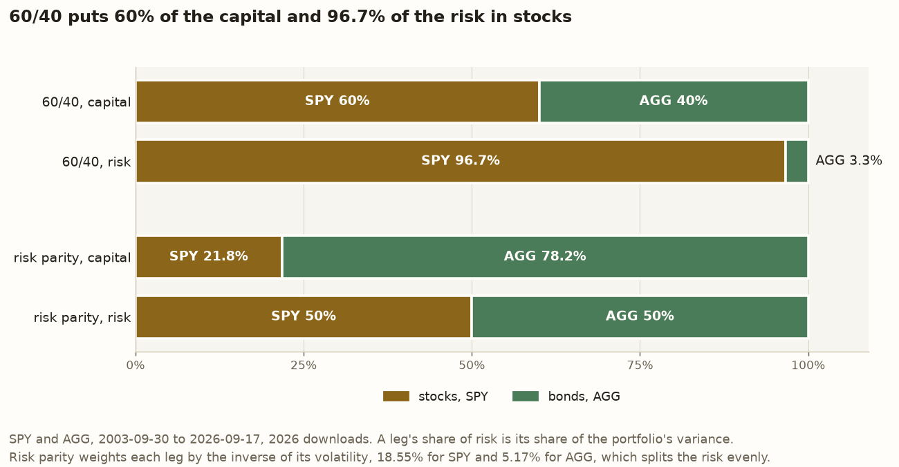

# Risk parity’s weights and leverage land close to Qian’s on SPY and AGG, and at a 4% cash rate its claim fails

*Qian’s method gives 21.8% stocks levered 1.98 times on 2003 to 2026 data, close to his 23% and 1.8. At a 4% cash rate, 60/40 earns more for its risk. At the 1.74% Treasury bills paid on average, the data cannot tell the two apart.*

## Why a close match is not enough

Ernest Chan’s *Quantitative Trading* (Chan, 2021) reports an argument by Edward Qian of PanAgora Asset Management, in a passage on why a lower-risk portfolio can be worth levering. A portfolio split 60% stocks and 40% bonds, usually called **60/40**, is balanced in its capital and nowhere near balanced in its risk, because stocks swing several times as hard as bonds. Qian’s alternative, **risk parity**, weights each asset so that it carries the same share of the risk, then borrows to bring the whole portfolio back up to 60/40’s risk.

Chan quotes the result in one sentence. At the same risk as 60/40, Qian recommends 23% stocks and 77% bonds, levered 1.8 times, to earn a higher **Sharpe ratio**. The Sharpe ratio is the return above cash divided by the size of the swings, so a higher one means more reward per unit of risk.

This replication runs the same calculation on SPY, the fund that tracks the S&P 500, and AGG, a fund that tracks the aggregate US bond market, from September 2003 to September 2026. The allocation comes out at 21.8% stocks against Qian’s 23%, and the leverage at 1.98 against his 1.8. Both are close. Chan’s risk-parity passage names no cash rate, so the Sharpe ratios borrow the 4% he assumes elsewhere in the book, when working out how much to lever SPY. The weights and leverage do not depend on the cash rate. At 4% the Sharpe ratio claim goes the other way. 60/40 earns 0.41 and levered risk parity 0.19. Treasury bills are short-term US government debt and the usual stand-in for cash. They paid 1.74% on average, less than 4%, by the St. Louis Fed’s three-month bill series, which the replication stores with its other data. Lesson 4 shows that at 1.74% the data cannot tell 60/40 and risk parity apart.

In two earlier replications of Chan’s examples, of [a cointegrated pair](https://baowebdev.substack.com/p/lessons-from-testing-gldgdx-for-cointegration) and of [the Kelly leverage on SPY](https://github.com/l3a0/quantitative-trading/blob/main/blog/kelly-leverage-on-spy.md), the figures moved a little and the central claims held. Here the figures also land close, and at a 4% cash rate the claim fails. This post explains how risk parity works and draws six lessons from the replication. The code is open source at [l3a0/quantitative-trading](https://github.com/l3a0/quantitative-trading).

## How risk parity works

A portfolio’s risk here is the standard deviation of its daily returns, stated as a yearly figure and called **volatility**. From 2003 to 2026, SPY’s volatility is 18.55% and AGG’s is 5.17%, so stocks swing 3.59 times as hard as bonds.

Call stocks asset 1 and bonds asset 2, with weights `w₁` and `w₂` and volatilities `σ₁` and `σ₂`. Their **correlation** `ρ` runs from −1 to +1 and measures how far the two tend to move together. The portfolio’s variance, the square of its volatility, is:

```math
\sigma_p^2 = w_1^2 \sigma_1^2 + w_2^2 \sigma_2^2 + 2 \rho\, w_1 w_2 \sigma_1 \sigma_2
```

The first term belongs to stocks, the second to bonds, and the third is shared. Giving each asset its own term plus half of the shared one splits the variance into two **risk contributions**, which add up to the whole. Each asset’s share of risk is its contribution divided by the total.

From 2003 to 2026 the correlation between SPY and AGG is −0.0002, close enough to zero that the shared term is negligible. Each asset’s risk is then its weight squared times its variance, and its share is that divided by the two added together. At 60/40, stocks contribute 0.6² × 18.55%² and bonds 0.4² × 5.17%². The first is about 29 times the second, so stocks carry 96.7% of 60/40’s risk and bonds 3.3%. Qian’s own data gave 93% to stocks.

Risk parity picks the weights that make the two contributions equal. Setting them equal puts the shared term on both sides, where it cancels, whatever the correlation is:

```math
w_1^2 \sigma_1^2 = w_2^2 \sigma_2^2 \quad\Rightarrow\quad w_1 \sigma_1 = w_2 \sigma_2
```

So each weight shrinks as its asset’s volatility grows, and an asset twice as volatile gets half the weight. With weights that sum to 1, the stock weight is `σ₂ / (σ₁ + σ₂)`, which is 5.17 divided by the sum of the two, or 21.8%. Bonds get 78.2%.



*60/40 is nearly an all-stock portfolio when measured by risk. Risk parity balances the risk by moving most of the capital into bonds.*

The replication rebalances both portfolios to their weights every trading day. Holding mostly bonds leaves risk parity about half as volatile as 60/40. Qian’s second step is to lever it until its volatility matches 60/40’s 11.32%, which here takes leverage of 1.98. At 1.98, every \$100 of the trader’s money holds \$43 of SPY and \$155 of AGG, and the trader borrows the extra \$98 at the cash rate.

Matching the volatilities turns the Sharpe comparison into a return comparison. With both portfolios at 11.32% volatility, the difference in their Sharpe ratios is the difference in their mean returns above cash, divided by 11.32%. That return gap is how many more percentage points a year the leading portfolio earned at 60/40’s risk, with borrowing charged at the assumed cash rate. Lesson 1 tests whether that gap could be luck.

Leverage scales a portfolio’s return above cash and its volatility by the same factor, so it leaves the Sharpe ratio unchanged. Levering risk parity therefore cannot change which one wins. What leverage does is let an investor who wants 60/40’s risk take it through risk parity’s mix instead, and that pays off exactly when the unlevered mix already has the higher Sharpe ratio.

Here are Qian’s figures beside the ones this replication computes. Qian (2005) used monthly returns on the Russell 1000 stock index and the Lehman Aggregate Bond Index from 1983 to 2004. He measured returns above the three-month Treasury-bill rate paid in each month, while this replication measures them above a fixed 4%. The two columns therefore cover different years, different stock indices and different cash rates.

```math
\begin{array}{l|r|r}
\text{Quantity} & \text{Qian, 1983 to 2004} & \text{SPY and AGG, 2003 to 2026} \\ \hline
\text{Stock volatility} & 15.1\% & 18.55\% \\
\text{Bond volatility} & 4.6\% & 5.17\% \\
\text{Stock-bond correlation} & 0.2 & -0.0002 \\
\text{Sharpe ratio, stocks} & 0.55 & 0.45 \\
\text{Sharpe ratio, bonds} & 0.80 & -0.18 \\
\text{Stocks' share of 60/40's risk} & 93\% & 96.7\% \\
\text{Risk-parity stock weight} & 23\% & 21.8\% \\
\text{Leverage to match 60/40} & 1.8 & 1.98 \\
\text{Volatility, 60/40} & 9.6\% & 11.32\% \\
\text{Sharpe ratio, 60/40} & 0.67 & 0.41 \\
\text{Sharpe ratio, levered risk parity} & 0.87 & 0.19
\end{array}
```

The two columns differ most in the bond Sharpe ratio, 0.80 against −0.18. A negative Sharpe ratio means AGG earned less than the assumed cash rate, and Lesson 2 explains why a bond Sharpe ratio below about 0.53 times stocks’ hands the comparison to 60/40. At the 1.74% bill average, AGG’s Sharpe ratio would be about 0.26 and SPY’s about 0.57. AGG’s 0.26 is 0.46 times SPY’s, still short of the 0.53 needed. Moving the cash rate from 4% to 1.74% lifts AGG’s Sharpe ratio by 0.44, from −0.18 to 0.26, a little under half of the 0.98 difference in bonds’ Sharpe ratio between the columns. The rest reflects bonds earning less above bills than in Qian’s years.

## Lesson 1: the numbers landed close and, at 4%, the claim did not survive

The allocation is about a point off Qian’s and the leverage about 0.2 above his. The method did what it says, too. At the 21.8% weight, each asset carries exactly 50% of the risk. Judged on those figures alone, the replication would pass.

Qian offered his weights and leverage in support of the Sharpe ratio claim, and on SPY and AGG that claim fails. At the 4% cash rate, 60/40 earns 0.41 and levered risk parity 0.19, a gap of 0.22 against risk parity. In mean returns above cash, 60/40 earns 2.46 percentage points a year more at the same volatility.


*The weight and leverage land close to Qian’s. Risk parity led 60/40 by 0.20 in his data, trails by 0.02 at the 1.74% bill average, and trails by 0.22 at 4%.*

A gap of 0.22 could still be luck. The standard check is a **t-statistic**. It divides the average daily difference between the two portfolios’ returns by how far that average would typically wander by chance. A t-statistic beyond 2 in either direction means a gap that large would arise by chance less than 5% of the time, the usual bar for naming a winner. The difference here is risk parity minus 60/40, so a negative t-statistic favours 60/40. Newey and West (1987) give a version that allows for each day’s return being related to the days before it, and this post uses it throughout. Here that version comes to −2.17, so at the 4% rate the 23 years are enough to name 60/40 the winner. The plain version, which treats each day as unrelated to the last, is −1.75 and would not clear the bar. The daily difference between the two portfolios tends to reverse from one day to the next, so its average wanders less than the plain version assumes, and the Newey-West version accounts for that. At 4% the verdict rests on the Newey-West figure. That verdict holds only above an assumed cash rate of 3.80%, as Lesson 4 shows.

## Lesson 2: balancing risk does not balance return

Equal risk says nothing about the return each unit of risk earns. Since leverage leaves Sharpe ratios alone, the comparison comes down to the Sharpe ratios of the two funds inside the mix.

Qian’s paper states that risk parity is the best mix of risk and return when the assets earn the same Sharpe ratio and their returns are uncorrelated. Beating 60/40 has a lower hurdle. Here, bonds need a Sharpe ratio a little over half of stocks’, about 0.53 times, as the arithmetic below shows. In Qian’s 1983 to 2004 data, bonds earned more per unit of risk than stocks did, not merely the same. His bonds returned 3.7% a year above Treasury bills, at a Sharpe ratio of 0.80 against 0.55 for stocks. So his levered risk-parity portfolio beat 60/40 by 2 points a year at the same risk.

On SPY and AGG, bonds miss even that lower hurdle. SPY averaged 12.36% a year and AGG 3.09%. Each figure is the mean daily return scaled to a year, which runs above what the fund compounded to. Against the 4% cash rate, SPY earned 8.36% a year above cash, a Sharpe ratio of 0.45, and AGG earned 0.91% below it, a Sharpe ratio of −0.18. A portfolio with 78.2% of its capital in AGG earns 1.11% above cash before leverage, and levering it 1.98 times lifts that to 2.20%. 60/40, with only 40% in AGG, earns 4.65%. Before rounding, the two returns differ by 2.46 points. That difference divided by the shared 11.32% volatility is the 0.22 by which 60/40 leads.

The hurdle bonds have to clear depends on how much each fund’s Sharpe ratio counts in each portfolio. Each fund adds its weight times its volatility times its Sharpe ratio to a portfolio’s return above cash, since a fund’s volatility times its Sharpe ratio is its return above cash. In risk parity the two weight-times-volatility products are equal. Call each one `a`, and write stocks’ Sharpe ratio `S₁` and bonds’ `S₂`. The variance formula above then gives a variance of `2(1 + ρ)a²`, and the return above cash is `a(S₁ + S₂)`, so:

```math
\text{Sharpe ratio of risk parity} = \frac{a\,(S_1 + S_2)}{a\sqrt{2(1 + \rho)}} = \frac{S_1 + S_2}{\sqrt{2(1 + \rho)}}
```

At a correlation near zero that is the sum divided by √2. For 60/40, each weight times its fund’s volatility, divided by 60/40’s 11.32%, gives how much each fund’s Sharpe ratio counts: 0.6 × 18.55 / 11.32 for stocks and 0.4 × 5.17 / 11.32 for bonds. So:

```math
\text{risk parity: } \frac{S_1 + S_2}{\sqrt{2}} \approx 0.71\,S_1 + 0.71\,S_2 \qquad \text{60/40: } 0.98\,S_1 + 0.18\,S_2
```

60/40’s two multipliers add to more than 1 because, with uncorrelated funds, 60/40’s volatility is less than the two funds’ weighted volatilities added together. Stocks’ multiplier sits near 1 because 60/40 is nearly all stock by risk. Subtracting one side from the other, with the unrounded multipliers, shows that risk parity comes out ahead when `0.525 S₂ > 0.276 S₁`, which means bonds’ Sharpe ratio has to be more than about 0.53 times stocks’. AGG’s −0.18 against SPY’s 0.45 falls far short. At Qian’s correlation of 0.2, with his 60/40 volatility of 9.6%, the same arithmetic puts the hurdle at about two-thirds and reproduces his printed 0.87 and 0.67. His bonds’ 0.80 against stocks’ 0.55 clears it easily.


*Each tick is the hurdle, the multiple of stocks’ Sharpe ratio that bonds need for levered risk parity to lead 60/40. Qian’s bonds cleared his by a wide margin. AGG fell just short at the 1.74% bill average and far short at 4%.*

## Lesson 3: Qian’s weights and leverage are really a volatility ratio and a correlation

Risk parity sets `w₁σ₁ = w₂σ₂`, so Qian’s 23-77 says his stocks were 77 / 23, or 3.3 times as volatile as his bonds. Two significant figures is all he printed. Any weights that round to 23 and 77 put the ratio between 3.26 and 3.44. Dividing the two volatilities in his paper gives about 3.3, and their own rounding allows 3.24 to 3.33, which overlaps that band. On SPY and AGG the ratio is 3.59, outside anything his rounded weights allow. The miss of about a point on the weight is the visible sign of that. Split at the Federal Reserve’s first rate rise of 2022, on 16 March, the ratio is 3.87 before and 2.76 after. Those land one on each side of his band, which Lesson 6 takes up. Lesson 5 explains why the replication splits the period there.

The leverage carries a second hidden input. Once the weights fix the volatility ratio, the leverage that matches 60/40 depends only on the correlation. A higher correlation raises risk parity’s variance by a larger fraction than 60/40’s, because the correlation acts only through the shared term. For a fixed sum of the stock and bond terms, the shared term is largest when the two are equal, as risk parity makes them. In 60/40 the stock term dwarfs the bond term, so the shared term adds little. At the volatility ratio Qian’s weights imply, moving the correlation from 0 to 0.2 raises risk parity’s variance by 20% and 60/40’s by about 8%, so the leverage that matches 60/40 falls from about 1.88 to about 1.78. At that ratio, 77 / 23, his 1.8 corresponds to a correlation of 0.16, and his paper prints 0.2. That correspondence is loose, though. Letting both his weights and his leverage vary within their rounding puts the correlation anywhere from −0.01 to +0.37, wide enough to include both zero and a clearly positive correlation.

![Two panels. The left one shows stocks’ volatility as a multiple of bonds’. Weights that round to 23 and 77 allow 3.26 to 3.44. Qian’s paper gives about 3.3, a range of 3.24 to 3.33 once its rounding is allowed for, which overlaps that band. SPY and AGG give 3.59 from 2003 to 2026, 3.87 up to March 2022 and 2.76 after, all outside both. The right one shows the leverage that matches 60/40 at each stock-bond correlation. On Qian’s weights, 1.8 corresponds to a correlation of 0.16, and his paper prints 0.2. Faint curves for the two ends of his weights’ rounding cross the ends of 1.8’s rounding at −0.01 and +0.37, the range of correlations his figures allow. On SPY and AGG’s weights, 1.98 corresponds to their measured −0.0002.](../docs/figures/risk_parity_ratio_and_correlation.png)

*Each of Qian’s two numbers, the 23-77 split and the 1.8 leverage, reads as one property of the market. SPY and AGG’s volatility ratio falls outside the band his weights allow, on different sides before and after March 2022. His 1.8 pins the correlation only loosely.*

So Qian’s 23-77 and 1.8 describe the stocks and bonds of 1983 to 2004 rather than a rule for all time. Lesson 6 shows both inputs moving within the SPY and AGG data.

## Lesson 4: the assumed cash rate decides which portfolio leads over the whole period

A Sharpe ratio needs a cash rate. The replication takes the 4% Chan assumes when working out how much to lever SPY, as a choice rather than a measurement. Qian used the bill rates actually paid. For 2003 to 2026, 4% is well above the average bill rate. The Federal Reserve held its policy rate near zero from December 2008 to December 2015 and again from March 2020 to March 2022, so bills paid close to nothing for about nine of the 23 years.

Leverage cannot change which portfolio wins at a given rate, but the rate itself can. The cash rate comes off both portfolios’ returns, and unlevered risk parity is about half as volatile, so each point cut from the rate lifts its Sharpe ratio about twice as much as 60/40’s. At matched volatility, the borrowing gives the exact size of that effect. The levered portfolio borrows \$0.98 for every dollar of the trader’s own money, and 60/40 borrows nothing. So each percentage point cut from the assumed rate adds 0.98 points a year to risk parity’s return above cash, relative to 60/40. Closing the 2.46-point gap takes a rate about 2.5 points lower, and the two Sharpe ratios tie at 1.50%. Below that, risk parity has the higher Sharpe ratio over the whole period.

The verdict at 4% is also close to the edge of what the data can settle. The t-statistic moves with the rate in a straight line, and it reaches −2 at an assumed 3.80%. In the other direction, even at a rate of zero, risk parity’s lead over the whole period has a t-statistic of only +1.30, too small to name it the winner.

Whether Treasury bills averaged above or below 1.50% from 2003 to 2026 decides which portfolio had the higher Sharpe ratio. Because each point of the rate moves the gap by a fixed amount, charging each month’s actual bill rate gives almost the same gap as charging the average of those rates, so the average can be set directly against the tie. The Federal Reserve Bank of St. Louis publishes the three-month bill rate as series TB3MS, and its monthly average from October 2003 to August 2026, the full calendar months inside the period, is 1.74%. That sits just above the tie. At 1.74%, 60/40’s Sharpe ratio is higher by about 0.02. The t-statistic of −0.21 is far short of the bar, so the data cannot tell the two apart. The replication stores that series with its other inputs, so the average can be rechecked from the same bytes.


*The rate bills actually paid lands just past the tie. The 4% this post assumes lands just past the rate where the data can name a winner.*

## Lesson 5: judged on weights from the earlier period, risk parity still trails in the later period

60/40’s weights are fixed in advance and use no data. Risk parity computes its weights from measured volatilities. Weights fitted to the same years used to score them have already seen every day of the test, which can favour risk parity in a way 60/40 never benefits from.

So the replication splits the period at 16 March 2022, the day the Federal Reserve made the first of its 2022 run of rate rises. It fixed the date before computing any result, and took it from an outside event rather than from the prices. The earlier period runs from 2003 to the day before the rise, and the later period from the day after it to 2026. The rest of the post calls them that. Weights for the later period come from the earlier period’s data, so they are the weights a trader would have held on the day, and the later period tests them on data they never saw. The whole period and the earlier period have no prior data to borrow from, so the replication scores them with weights fitted to those same years. Only the later period’s weights are free of that possible advantage.

![Four rows of Sharpe ratios at an assumed 4% cash rate, each an arrow from 60/40 to levered risk parity. Over the whole period, on weights fitted to the same years with 21.8% in stocks, 60/40 earns 0.41 and risk parity 0.19, a gap of 0.22 with a t-statistic of −2.17. In the earlier period, on weights fitted to the same years with 20.5% in stocks and leverage of 2.15, 60/40 earns 0.38 and risk parity 0.23, a gap of 0.16 with a t-statistic of −1.35, short of the bar of 2. In the later period, on the 20.5% weights carried from the earlier period, which never saw these years, 60/40 earns 0.51 and risk parity 0.01, a gap of 0.50, with a t-statistic of −2.20 at leverage 1.66 and −1.64 at the carried 2.15. With hindsight, on weights fitted to the later period with 26.6% in stocks, risk parity earns 0.13 against 60/40’s 0.51, a gap of 0.38, so hindsight closes 0.12 of the 0.50, about a quarter.](../docs/figures/risk_parity_by_window.png)

*In the later period risk parity trails by 0.50 on the weights a trader held, and weights fitted to the later period with hindsight narrow that only to 0.38. The t-statistic clears the bar of 2 at the 1.66 leverage measured on the later period and falls short at the 2.15 a trader held.*

The earlier period on its own does not name a winner. 60/40 leads by 0.16, and a t-statistic of −1.35 is within what chance could produce. Its ranking also flips with a smaller cut in the rate. The two portfolios tie at 2.45%, against 1.50% for the whole period. Bills averaged 1.17% over those years. At that rate risk parity’s Sharpe ratio is higher by about 0.13 in the earlier period. The t-statistic of +1.12 is again short of the bar, so the data cannot tell the two apart.

Of the whole period and its two parts, the later period is where risk parity does worst. At the 4% rate, 60/40 earns a Sharpe ratio of 0.51 and risk parity 0.01, a gap of 0.50. The gap is wide enough that only a rate of −4.43% would tie the two, so no positive rate changes which has the higher Sharpe ratio. Bills averaged 4.18% over these years by the same St. Louis Fed series, close to the assumed 4%, so this is the period where the choice of rate matters least.

Weights fitted to the later period itself would have narrowed the gap from 0.50 to 0.38, with 60/40 still ahead. So about three-quarters of the gap would remain even with hindsight, and only 0.12 comes from carrying the earlier weights forward. Here hindsight helped, because the later period’s own volatilities raised the stock weight from 20.5% to 26.6% in years when stocks earned far more per unit of risk than AGG. It need not help. Risk parity’s weights use volatilities rather than returns, and leverage leaves a Sharpe ratio alone. So fitted weights can gain only through the split between stocks and bonds, and only if the measured volatilities happen to tilt it toward the split that earned the most per unit of risk over the same years. They can as easily tilt it the other way.

Whether the data can tell the two apart in the later period depends on the leverage. The scored portfolio keeps the earlier 20.5% stocks. In the earlier period that mix needed leverage of 2.15 to match 60/40. In the later period, 1.66 is enough, and at that matched risk the t-statistic is −2.20. That clears the bar at 4%, and the t-statistic stays beyond −2 down to an assumed 3.25%.

The replication measures that 1.66 on the same years it judges, though, and a trader on the day would have held the earlier 2.15. At 1.66 the test asks whether 60/40 earned more per unit of risk. At 2.15 it asks whether 60/40 earned more than the portfolio a trader actually held. That portfolio carries more risk than 60/40, because bonds grew more volatile and moved with stocks in the later period, as Lesson 6 shows. Neither Sharpe ratio depends on the leverage, so the gap of 0.50 stays put. The t-statistic works on the daily difference between the levered portfolio’s returns and 60/40’s. More leverage makes that difference swing harder but barely moves its average, because risk parity earned almost nothing above cash in those years. At 2.15 the t-statistic shrinks to −1.64, short of the bar of 2, so on the leverage a trader held, four and a half years at 4% are too few to name 60/40 the winner. Both leverages are defensible.

Scored over all 23 years, weights fitted to the earlier period alone would give risk parity a Sharpe ratio of 0.18, and weights fitted to the later period alone would give it 0.25, against 0.19 for weights fitted to the whole period. These are whole-period figures, unlike the later-period rows in the figure above. Both periods lie inside the whole one, so this is a check on the choice of weights rather than a test on unseen data. Each result is well behind 60/40’s 0.41, so the choice of weights does not close 60/40’s lead.

## Lesson 6: the volatility ratio and the correlation moved between the periods, but AGG’s return decided the later one

Each period, measured on its own data:

- In the earlier period, AGG’s volatility was 4.88%, SPY swung 3.87 times as hard, and the correlation was −0.07. Risk parity held 20.5% stocks and needed leverage of 2.15.
- In the later period, AGG’s volatility was 6.21%, SPY swung 2.76 times as hard, and the correlation was +0.24. Weights fitted to this period would hold 26.6% stocks. The portfolio actually scored kept the earlier 20.5% and needed leverage of 1.66 to match 60/40.

The volatility ratio fell from 3.87 to 2.76, and the two periods sit on opposite sides of the 3.26 to 3.44 band Qian’s weights allow. The near-zero correlation of −0.0002 over the whole period is a blend of a negative stretch in the earlier period and a positive one in the later period, rather than a stable property of stocks and bonds. The falling volatility ratio moved the weights, and together with the rising correlation it moved the leverage.

Even weights fitted to the later period hold only 26.6% stocks, short of 60/40’s 60%, so risk parity still leans on bonds, and its result rests on what AGG earned. AGG averaged 1.16% a year, a Sharpe ratio of about −0.46 against SPY’s 0.66, or about −0.69 times stocks’. On those weights, at the later period’s correlation of +0.24, the hurdle was about 0.70, so AGG fell far short. A lower correlation lowers the hurdle, and at correlations below about −0.62 it turns negative, meaning risk parity could lead even with a bond Sharpe ratio a little below zero. That happens because risk parity’s volatility shrinks faster than 60/40’s as the two funds’ swings cancel. The hurdle reaches AGG’s −0.69 only at a correlation below about −0.96, where stocks and bonds move almost exactly opposite each other. None of the correlations measured here comes near that.

The portfolio actually scored kept the earlier 20.5% stocks, and its hurdle was higher still, about 0.78 at +0.24. That hurdle stays above about −0.37 times stocks’ Sharpe ratio at every correlation, well above AGG’s −0.69, so on those weights no correlation at all would have closed the gap.

![The hurdle bonds’ Sharpe ratio had to clear in the later period, after the March 2022 rise, as a multiple of stocks’, against the stock-bond correlation from −1 to +0.5. Only the correlation varies, with the later period’s volatilities held fixed. On weights fitted to the later period with hindsight, the hurdle is 0.70 at the measured +0.24, turns negative at correlations below −0.62, and meets AGG’s −0.69 only at correlations below −0.96. On the 20.5% stock weights carried from the earlier period, which the post scores, it is 0.78 at +0.24 and never falls below −0.37 times stocks’ Sharpe ratio. The measured correlations, −0.07 in the earlier period, −0.0002 over the whole period and +0.24 in the later period, are marked.](../docs/figures/risk_parity_hurdle_by_correlation.png)

*AGG’s line stays far below both curves at every correlation these funds showed. At the 4% rate, on the weights actually carried into the later period, no correlation at all would have closed the gap. Read at the whole period’s −0.0002, the solid curve gives about 0.56, above Lesson 2’s 0.53, because it keeps the later period’s volatilities.*

## What this replication cannot say

The replication tests Qian’s argument on funds and years it fixed in writing before computing any number. It cannot say three things.

1. **Whether Qian’s own data reproduces his numbers.** He used the Russell 1000 from 1983 to 2004, and this replication uses SPY, which tracks the S&P 500, from 2003 on. AGG tracks his bond index but only opened in 2003. The two data sets overlap by at most 15 months.
2. **Whether costs change the result.** The book charges no trading costs and no borrowing spread above the cash rate, so neither does the replication. Both would hurt the levered risk-parity portfolio more than 60/40, so charging them could only move the result toward 60/40.
3. **Which allocation anyone should hold.** A replication uses its data to check someone else’s claim. It says whether the claim held on these funds over these years, and nothing about the next twenty years.

## What this means for a trader

Six habits follow from the lessons above.

1. **Check the claim, not only the numbers.** An allocation about a point off and a leverage about 0.2 off can still carry a conclusion that fails.
2. **Compare the Sharpe ratios inside a mix before levering it.** Leverage cannot raise a Sharpe ratio, so a low-risk mix beats a riskier one only if what it holds earns enough per unit of risk. At the near-zero correlation measured here, bonds needed a little over half of stocks’ Sharpe ratio, about 0.53 times.
3. **Name the cash rate, and find the rate where the ranking flips.** Any comparison between a levered and an unlevered portfolio depends on the cash rate. Here the ranking over the whole period flips at 1.50%, and below an assumed 3.80% the data can no longer name 60/40 the winner.
4. **Judge weights on data they did not see.** Weights fitted to the data that judges them can start with an advantage over weights fixed beforehand. In the later period, weights fitted to it would have narrowed the gap from 0.50 to 0.38.
5. **Report a ranking with its size and its t-statistic.** A statement that one Sharpe ratio beats another hides whether the gap is 0.01 or 0.50, and whether the data can tell the two portfolios apart.
6. **Treat a published allocation as a snapshot.** Qian’s 23-77 and 1.8 encode one period’s volatility ratio and correlation, and both moved across the March 2022 rise. Re-estimate them before borrowing someone else’s weights.

At a 4% cash rate on SPY and AGG from 2003 to 2026, risk parity balances the risk exactly as described, and 60/40 still earns the higher Sharpe ratio at the same volatility. Whether balanced risk pays depends on bonds earning enough per unit of risk beside stocks, a little over half as much at the near-zero correlation measured here and about two-thirds at Qian’s 0.2. Bonds cleared that hurdle in Qian’s years. In these they missed it badly at 4%, and at the 1.74% bill average they fell just short.

## References

- Chan, E. P. (2021). *Quantitative Trading: How to Build Your Own Algorithmic Trading Business* (2nd ed.). Wiley.
- Newey, W. K., & West, K. D. (1987). A simple, positive semi-definite, heteroskedasticity and autocorrelation consistent covariance matrix. *Econometrica*, 55(3), 703–708.
- Qian, E. (2005). *Risk Parity Portfolios: Efficient Portfolios Through True Diversification*. PanAgora Asset Management.

*Not investment advice. Code: [the risk-parity calculation](https://github.com/l3a0/quantitative-trading/blob/main/src/chan/risk_parity.py), and [the charts](https://github.com/l3a0/quantitative-trading/blob/main/src/chan/risk_parity_figures.py), with the checks behind [the calculation’s numbers](https://github.com/l3a0/quantitative-trading/blob/main/tests/test_risk_parity.py) and [what the charts draw](https://github.com/l3a0/quantitative-trading/blob/main/tests/test_risk_parity_figures.py), and the [replication log](https://github.com/l3a0/quantitative-trading/blob/main/docs/replication-log.md#entry-4-risk-parity-against-6040-chans-quantitative-trading) that sets each of Chan’s and Qian’s figures beside the one reproduced here.*
